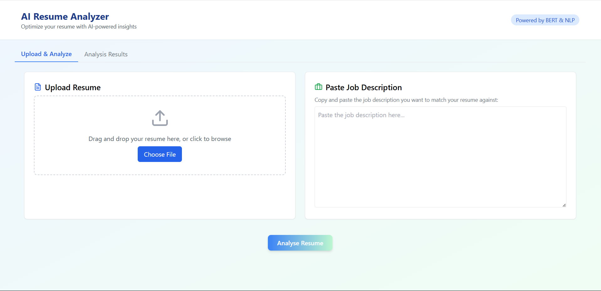
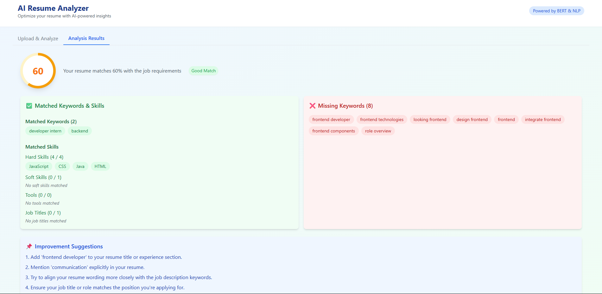
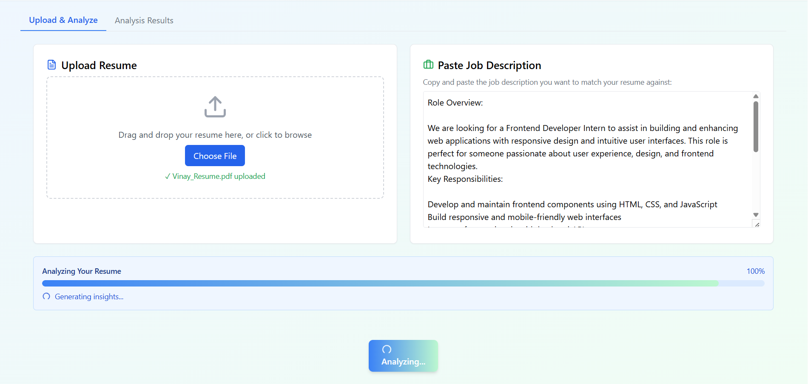

# Resume Analyser
This is a **Resume Analyser** that analyzes resumes against job descriptions using NLP techniques.It extracts and compares keywords, skills, and job titles, calculates semantic similarity with Sentence-BERT, and provides an ATS compatibility check. The system generates a match score out of 100 and offers personalized suggestions to improve resume score.

